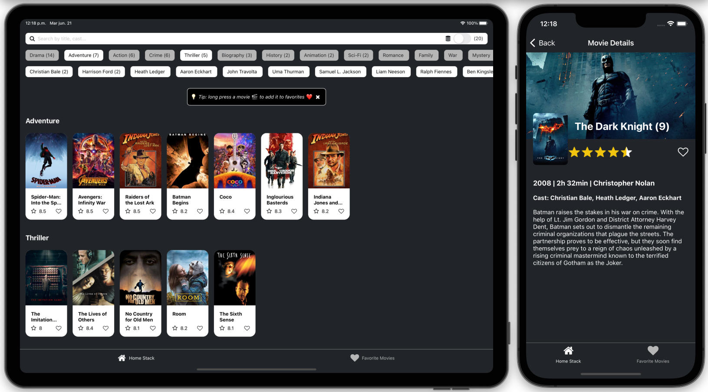
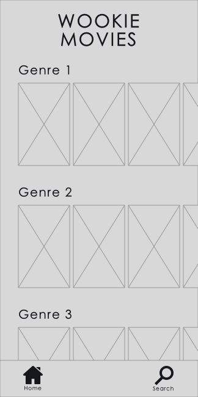
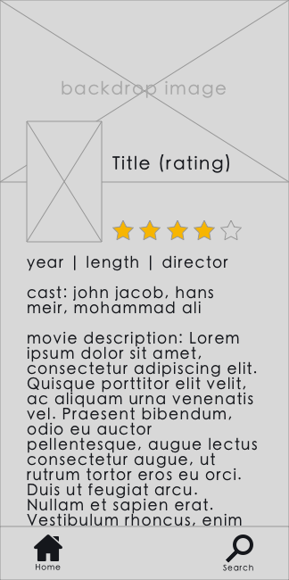

# 🎬 Wookie Movies

## 🍿 Netflix clone with ⚛️ React Native - Typescript

by Guillermo Sierra


## Tech Stack

- 🎨 Types: [Typescript](https://www.typescriptlang.org/)
- ⛓ Routing: [React Navigation](https://reactnavigation.org/)
- ⚙ ️State management: [MobX](https://mobx.js.org/) - True separation of concerns: state and view
- 🖌 Styling: [Consistencss](https://consistencss.now.sh/)
- 🧪 Unit tests

## Features

- 🔍 Search  
    - Offline 
    - Through API
  
- ❤️ Favorite movies 

- 🔬 Filters
    - Categories (genres)
    - Cast (actors)
  

- 💡 Collapsable Tip for Favorites with Toast info
- 🙅‍♂️ Empty state `404` component
- 🌘 Dark Mode
- 🎞 Sticky Header
- 📡 Offline support
- 🧪 Unit Testing: `utils/data`

## ✨ Future ideas
- 💻 React Native Web support
- 🧪 Increase Test coverage
- Search with different keys

## Mockups



## Install

### ios:

```
cd ios && pod install
yarn start
react-native run-ios
```

## Test Instructions

### Objective

Your assignment is to implement a React Native movie listing app.

### Brief

You are the owner of a movie theater in **Thikkiiana City,** on the Wookiee homeworld of Kashyyyk. Your customers are bored with the never changing selection and are asking for something completely different - they want to see what's playing on Earth. Wookies are the main exporter of Computer Technology for the New Republic so naturally you roll up your sleeves and get to work. You quickly scribble down some notes and after a few hours of relentless work you have a design in mind.

### Tasks

-   Implement a React Native movie listing app
-   Build out the project to the designs inside the `/Designs` folder
-   Connect your application to the **CodeSubmit Movie Database** at `https://wookie.codesubmit.io/movies`
-   For authentication pass the `"Authorization: Bearer Wookie2019"` header
-   Parse the API response and display the results as outlined in the design. **Make sure to group movies by categories**.
-   Implement a detail view for the movies in the list
-   Implement the search view by connecting to `https://wookie.codesubmit.io/movies?q=<search_term>`
-   Surprise us! Add a feature that you think would work well here (for instance, advanced search, integration with other API, a "Favorite" functionality)
    -   Describe the feature in separate markdown file

### Deliverables

Make sure to include all source code in this repository.

For iOS, include a assignment.zip file containing your compressed .app bundle **in the root of the repository**.
Your .app bundle must represent a simulator build of your app. After running in iOS Simulator via Xcode, look in ~/Library/Developer/Xcode/DerivedData/<project-name>/Build/Products/Debug-iphonesimulator/.
Alternatively, you may run xcodebuild -sdk iphonesimulator (if you use .xcodeproj) or xcodebuild -sdk iphonesimulator -workspace Sample.xcworkspace/ -scheme <your-scheme> -configuration Debug (if you use .xcworkspace) in your project directory, then zip the .app bundle in build/Debug-iphonesimulator/.

For Android, include assignment.apk containing your app **in the root of the repository**.
After your app is built, either via Android Studio or by running the command ./gradlew assembleDebug in your project directory, look in <project-name>/<module-name>/build/outputs/apk/.

### Evaluation Criteria

-   **React Native** best practices
-   Show us your work through your commit history
-   Completeness: did you complete the features?
-   Correctness: does the functionality act in sensible, thought-out ways?
-   Maintainability: is it written in a clean, maintainable way?
-   Testing: is the system adequately tested?

### CodeSubmit

Please organize, design, test and document your code as if it were
going into production - then push your changes to the master branch. After you have pushed your code, you may submit the assignment on the assignment page.

All the best and happy coding,

The token.com Team
